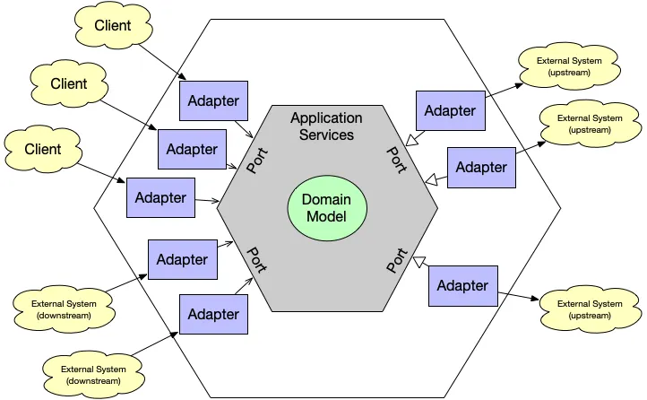

# 📐 Hexagonal Architecture in Nestjs

Hexagonal Architecture (also known as Ports and Adapters) is a software design pattern that helps create applications that are independent of external frameworks, databases, and delivery mechanisms. Instead of tying core business logic directly to tools like ORMs, web frameworks, or third-party APIs, the architecture organizes code into clear boundaries:

Core (Domain): The heart of the system, where business rules and logic live.

Ports: Interfaces that define how the core communicates with the outside world.

Adapters: Implementations of those interfaces, such as REST controllers, database repositories, or message brokers.

This separation makes your application more maintainable, testable, and adaptable. You can replace a database, switch from REST to GraphQL, or integrate a new external service without rewriting the business logic.

In the context of NestJS, Hexagonal Architecture ensures your application doesn’t just “work” but also scales gracefully, remains easy to test, and is future-proof against changes in technology choices.
